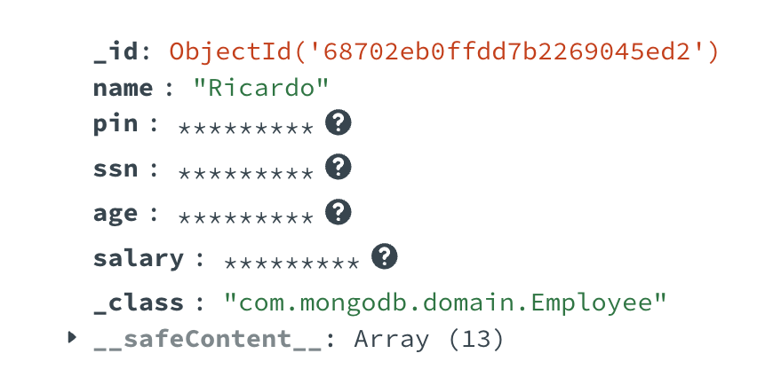

# Spring Data Queryable Encryption

This repository demonstrates how to integrate **MongoDB Queryable Encryption** with **Spring Data MongoDB**. 
You can read more on
- link to be defined


## About the Project

This is a sample **Spring Boot** application that stores and retrieves employee records using **MongoDB Queryable Encryption**. It showcases how to:

- Encrypt fields using annotations (`@Encrypted`, `@RangeEncrypted` and `@Queryable`)
- Run equality and range queries securely on encrypted data

Below is a visual representation of how encrypted documents appear in **MongoDB Compass**:



> Encrypted fields (`pin`, `ssn`, `age` and `salary`)

### Encrypted Fields Summary

| Field    | Type     | Encrypted | Queryable | Query Type     | Notes                                                  |
|----------|----------|-----------|-----------|----------------|---------------------------------------------------------|
| `name`   | String   | ❌        | ✅         | Equality       | Not encrypted; can be queried freely                   |
| `pin`    | String   | ✅        | ❌         | —              | Encrypted but not queryable     |
| `ssn`    | int      | ✅        | ✅         | Equality       | Encrypted and queryable using equality (`@Queryable`)  |
| `age`    | Integer  | ✅        | ✅         | Range (int)    | Encrypted and queryable with range filters (`<`, `>`)  |
| `salary` | double   | ✅        | ✅         | Range (decimal)| Encrypted and queryable with decimal range (precision: 2) |

## Prerequisites
Before running this project, make sure you have:

- Java 17 or higher (tested with Corretto 21)
- Maven 3.6+
- MongoDB 8.0+ running as a **replica set**
- MongoDB crypt_shared library installed 
  - [`Dowload the Automatic Encryption Shared Library`](https://www.mongodb.com/docs/v6.0/core/queryable-encryption/reference/shared-library/#download-the-automatic-encryption-shared-library)


## Getting Started

### 1. Clone the repository

```bash
git clone https://github.com/mongodb-developer/spring-data-queryable-encryption.git

cd spring-data-queryable-encryption
```

### 2. Set Environments

Make sure you're inside the project folder spring-data-queryable-encryption before running the next steps.

On Linux/macOS:
````
export MONGODB_URI="<YOUR_CONNECTION_STRING>" CRYPT_PATH="<PATH_TO_AUTOMATIC_ENC_SHA_LIB.dylib>"

````
On Windows
````
$env:MONGODB_URI="<YOUR_CONNECTION_STRING>"; $env:CRYPT_PATH="<PATH_TO_AUTOMATIC_ENC_SHA_LIB.dll"
````
### 3. Run the application

```bash
mvn spring-boot:run
```


## Sample Data

When the application starts, it automatically creates a collection called **`employees`** in the **`hrsystem`**
database (only if it's empty) and inserts 6 sample employees. You can use these records to test the API directly in Swagger or with `.http` files.

| Name    | PIN | SSN | Age | Salary |
|---------|-----|-----|-----|--------|
| Ricardo | 001 | 1   | 36  | 1501   |
| Maria   | 002 | 2   | 28  | 4200   |
| Karen   | 003 | 3   | 42  | 2800   |
| Mark    | 004 | 4   | 22  | 2100   |
| Pedro   | 005 | 5   | 50  | 4000   |
| Joana   | 006 | 6   | 50  | 99000  |


You can now try endpoints like:

```http
GET /employees
GET /employees/ssn/1
GET /employees/filter/age-less-than?age=30
GET /employees/filter/salary-greater-than?salary=3500
```

## API Documentation – Swagger UI
Once the application is running, access:

```bash
http://localhost:8080/swagger-ui.html
```
Or (for some versions):

```bash
http://localhost:8080/swagger-ui/index.html
```
It includes endpoints for:

- /employees → Manage employees records

## Example Endpoints
Create a Employee
```bash
POST /employees
Content-Type: application/json

{
  "name": "Ricardo",
  "pin": "0441",
  "ssn": 12,
  "age": 36,
  "salary": 1200
}

```

Find All employees

```bash
GET /employees
```

Find by SSN (encrypted query)

```bash
GET /employees/ssn/12
```

Find employees with age less than a value
```bash
GET /employees/filter/age-less-than?age=50
```

Find employees with salary greater than a value
```bash
GET /employees/filter/salary-greater-than?salary=100.0
```

## HTTP Client Support (IDE Integration)
This project includes ready-to-use .http files to test all API endpoints easily from your IDE (such as IntelliJ IDEA, Rider, or VSCode with REST Client plugin).

### Files included:
- employee_requests.http → Test all endpoints under /employees

### How to use:
1. Open the .http file in IntelliJ.
2. Click on the green "Run" icon next to any request.
3. You’ll see the response in a built-in HTTP client tab.

